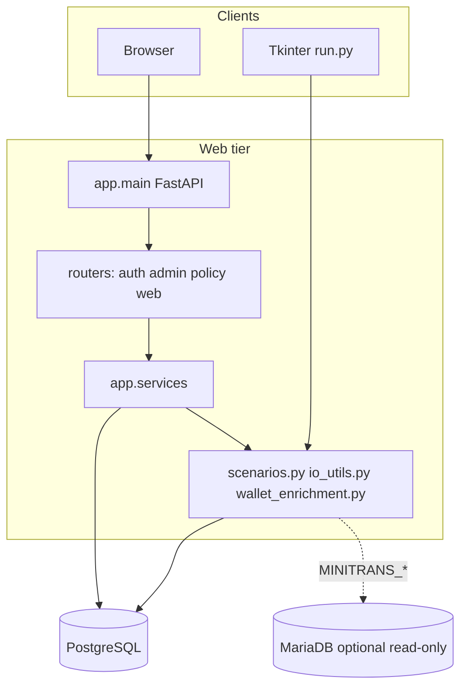

# Agent context — Hosted Checkout Monitoring

This document gives AI coding agents enough context to navigate the codebase, add features, and fix bugs without re-discovering architecture from scratch. For human setup and deployment, see [README.md](README.md) and [deploy/rhel9/README.md](deploy/rhel9/README.md).

---

## 1. What this system does

**Card cash-in monitoring** for Visa/Mastercard-style **hosted checkout** activity:

- Ingest **card-not-present transactions** (Excel) keyed by **BIN + last four**, linked to a **mobile wallet (MSISDN)**.
- Run **AML-style monitoring scenarios** (daily D1–D3, weekly W1–W3) to flag unusual **load (credit) cash-in** patterns.
- Provide a **web UI** for investigators and supervisors: triage detections, workflow status, notes, imports, thresholds, exports.

**Two entry points share one rule engine:**

| Entry | Path | Purpose |
|-------|------|---------|
| Web UI | `app/` + `uvicorn app.main:app` | Primary production system |
| Desktop tool | `run.py` (Tkinter) | Offline Excel → per-scenario `.xlsx` outputs |

Root modules `scenarios.py`, `io_utils.py`, and `wallet_enrichment.py` are imported by both paths so scenario logic stays consistent.

---

## 2. Tech stack

| Layer | Technology |
|-------|------------|
| Language | Python **3.13** (`pyproject.toml`, `.python-version`) |
| Web | FastAPI, Jinja2 HTML templates, HTMX partials, signed cookie sessions |
| ORM / DB | SQLAlchemy 2.x, Alembic, **PostgreSQL** (JSONB for payloads/metrics) |
| Data / scenarios | pandas, numpy, openpyxl |
| Optional enrichment | **MariaDB/MySQL** read-only via `pymysql` (`MINITRANS_*` env) |
| Auth | passlib password hashes, role-based access in `app/deps/auth.py` |
| Production deploy | **RHEL 9**, rootless **Podman Compose** (`docker-compose.yml`) |
| Windows dev | Docker Desktop, `run_setup.cmd` |

---

## 3. System architecture



**Request flow (typical web page):**

1. `SessionMiddleware` + `SecurityHeadersMiddleware` in `app/main.py`
2. Router handler (`app/routers/*.py`) — auth via `Depends(require_*)`
3. Service layer (`app/services/*.py`) — business logic, DB access
4. Jinja2 template render or HTMX partial (`app/templates/`)

**Scenario pipeline (import → detection):**

1. Supervisor uploads `.xlsx` → `import_service` parses via `io_utils.read_transactions_xlsx`, stores rows in `transaction_rows.payload` (JSONB)
2. Supervisor runs scenarios on batch → `scenario_run.run_scenarios_for_batch` builds pandas DataFrame, calls `scenarios.py` runners, enriches metrics via `wallet_enrichment` + optional MariaDB
3. Detections persisted in `detections` with `metrics` JSONB and `raw_row_indices`
4. Investigators/supervisors triage via status transitions, notes, export

**Rolling scenarios:** `scenario_run` also supports cross-import windows (`scope_type=rolling`, migrations 008+). Supervisors trigger via `POST /scenarios/run-rolling`.

---

## 4. Repository layout

```
hosted-checkout-monitoring/
├── app/                      # FastAPI web application package
│   ├── main.py               # App factory, middleware, router mounts
│   ├── config.py             # Settings from .env (not cached)
│   ├── constants.py          # Scenario labels, status workflow, metric display order
│   ├── models.py             # SQLAlchemy ORM models
│   ├── database.py           # Engine + get_db dependency
│   ├── startup_checks.py     # Production security validation at startup
│   ├── templating.py         # Jinja2Templates singleton
│   ├── jinja_filters.py      # Template filters (metrics formatting, etc.)
│   ├── template_ctx.py       # Shared template context helpers
│   ├── deps/
│   │   ├── auth.py           # Session auth, role dependencies
│   │   ├── login_next.py     # Post-login redirect sanitization
│   │   └── login_rate_limit.py
│   ├── middleware/
│   │   └── security_headers.py
│   ├── routers/
│   │   ├── auth_routes.py    # Login, logout, password change
│   │   ├── admin_routes.py   # User CRUD (admin only)
│   │   ├── policy_routes.py  # Investigator status policy (supervisor)
│   │   └── web.py            # Main UI: detections, imports, scenarios, transactions
│   ├── services/
│   │   ├── import_service.py       # Excel upload, dedupe by UniqueId
│   │   ├── scenario_run.py         # Batch + rolling scenario execution
│   │   ├── detections_service.py   # Status changes, bulk ops, queues
│   │   ├── detections_export.py    # Supervisor Excel export
│   │   ├── thresholds_service.py   # scenario_config CRUD
│   │   ├── policy_service.py       # investigator_status_policy
│   │   ├── auth_service.py         # Password verify/hash
│   │   ├── users_service.py
│   │   ├── serialize.py            # JSON-safe metric serialization
│   │   ├── note_permissions.py
│   │   └── external_enrichment_retry.py
│   ├── scripts/
│   │   ├── create_admin.py   # Bootstrap admin user CLI
│   │   └── truncate_detections.py
│   ├── static/               # app.css, table-sort.js, htmx.min.js (bundled)
│   └── templates/            # Jinja2 HTML + partials/ for HTMX
├── alembic/                  # DB migrations (canonical schema source)
├── tests/                    # pytest (security smoke, auth helpers)
├── deploy/rhel9/             # Production Podman runbook, systemd, nginx example
├── scenarios.py              # Core scenario algorithms (D1–D3, W1–W3)
├── io_utils.py               # Excel I/O, MariaDB reads, column normalization
├── wallet_enrichment.py      # Metric enrichment, row slicing for detections
├── run.py                    # Desktop Tkinter scenario runner
├── scenarios.json            # Desktop tool threshold overrides
├── docker-compose.yml        # db + web services (Podman/Docker)
├── Dockerfile                # Web container image
├── docker-entrypoint.sh      # alembic upgrade + uvicorn
├── run_setup_rhel.sh         # Linux/RHEL Podman setup helper
├── run_setup.cmd / .ps1      # Windows Docker db-only setup
└── .env.example              # Environment variable reference
```

---

## 5. User roles and access

Three fixed roles (`User.role`):

| Role | Access |
|------|--------|
| **admin** | User management only (`/admin/users/*`). Redirected away from operational pages. |
| **supervisor** | Imports, scenarios, thresholds, rolling runs, exports, bulk status, investigator policy |
| **investigator** | Detections list/detail, status changes (within policy), notes |

Auth dependencies in `app/deps/auth.py`:

- `require_user` — any logged-in active user
- `require_supervisor_or_investigator` — case work (blocks admin)
- `require_supervisor` — imports/scenarios/export
- `require_admin` — user admin
- `require_roles("supervisor", ...)` — factory for custom role sets

Sessions: signed cookie via Starlette `SessionMiddleware`. Keys: `user_id`, `login_at`, `last_activity`. Idle and max-age enforced in `_session_uid`.

**Investigator maker-checker:** `InvestigatorStatusPolicy` (singleton row `id=1`) stores `allowed_map` JSONB. `policy_service` intersects with `ALLOWED_TRANSITIONS` in `app/constants.py`.

---

## 6. Feature map (routes → capability)

### Auth (`app/routers/auth_routes.py`)

| Method | Path | Description |
|--------|------|-------------|
| GET/POST | `/login` | Login form; rate-limited |
| POST | `/logout` | Clear session |
| GET/POST | `/account/password` | Self-service password change |

### Admin (`app/routers/admin_routes.py`)

| Method | Path | Description |
|--------|------|-------------|
| GET | `/users` | List users |
| POST | `/users/create` | Create user |
| POST | `/users/{id}/role` | Change role |
| POST | `/users/{id}/active` | Enable/disable |
| GET/POST | `/users/{id}/display-name` | Edit display name |
| GET/POST | `/users/{id}/password` | Reset password |

### Policy (`app/routers/policy_routes.py`)

| Method | Path | Description |
|--------|------|-------------|
| GET/POST | `/investigator-policy` | Supervisor edits allowed status transitions for investigators |

### Web (`app/routers/web.py`) — main application

| Area | Key routes |
|------|------------|
| Health | `GET /health` — no DB required |
| Home | `GET /` — redirects to detections or login |
| Detections | `GET /detections` — filtered list (queue, status, scenario, date) |
| | `GET /detections/{id}` — detail, metrics, notes, status form |
| | `POST /detections/{id}/status` — workflow transition |
| | `POST /detections/bulk-status`, `POST /detections/bulk-delete-test` |
| | `GET /detections/export` — supervisor Excel download |
| Notes (HTMX) | `POST/GET /detections/{id}/notes`, edit, delete partials |
| Transactions | `GET /transactions` — explorer across imports |
| | `GET /imports/{batch_id}/transactions` — popup table partial |
| Imports | `GET /imports`, `POST /imports` — upload Excel |
| | `GET /imports/{batch_id}`, `POST /imports/{batch_id}/run` — run batch scenarios |
| Scenarios | `GET /scenarios`, `GET/POST /scenarios/{id}` — config per scenario |
| | `POST /scenarios/{id}/test` — sandbox test run |
| | `POST /scenarios/run-rolling` — rolling window run |
| | `POST /scenarios/retry-external-enrichment` |
| Thresholds | `GET /thresholds`, `POST /thresholds` — global threshold form |

---

## 7. Monitoring scenarios

Defined in `scenarios.py`. Codes in `app/services/thresholds_service.py` → `SCENARIO_CODES`.

| ID | Period | Pattern |
|----|--------|---------|
| **D1** | Daily | Many cards → one wallet (volume) |
| **D2** | Daily | One card → many wallets |
| **D3** | Daily | Multiple failed/rejected transactions |
| **W1** | Weekly | Many cards → one wallet (higher thresholds) |
| **W2** | Weekly | One card → many wallets |
| **W3** | Weekly | Multiple failed transactions |

**Configuration** lives in `scenario_config` (single row, thresholds + `monitored_banks`, `scenario_enabled`, `scenario_labels`).

**Parameters** map to `ScenarioParams` dataclass in `scenarios.py`. Web UI reads/writes via `thresholds_service`.

**Risk sub-scoring:** D1/D2 support optional high-risk thresholds (`d1_risk_*`, `d2_risk_*` columns, migration 007).

**Monitored banks:** JSONB filter on `OPP_card.issuer.bank` column (substring match, pipe-separated).

When adding or changing scenario logic:

1. Update algorithm in `scenarios.py`
2. Add/adjust thresholds in `ScenarioConfig` model + Alembic migration if schema changes
3. Wire labels in `app/constants.py` (`SCENARIO_LABELS`, `METRIC_KEY_LABELS`)
4. Ensure `scenario_run.py` maps output rows → `Detection` records correctly
5. Update desktop `run.py` / `scenarios.json` if desktop parity needed

---

## 8. Data model (PostgreSQL)

ORM: `app/models.py`. Migrations: `alembic/versions/` (apply with `alembic upgrade head`).

| Table | Purpose |
|-------|---------|
| `import_batches` | Uploaded Excel metadata (`uploaded` / `ready` / `failed`) |
| `transaction_rows` | One row per transaction; `payload` JSONB; optional `transaction_external_id` (UniqueId) |
| `scenario_config` | Singleton thresholds and scenario toggles |
| `detections` | Scenario hits; `metrics` JSONB; `scope_type` (`batch` \| `rolling`); workflow `status` |
| `notes` | Investigator notes on detections |
| `status_history` | Audit trail of status changes |
| `users` | Auth accounts (`admin` \| `supervisor` \| `investigator`) |
| `investigator_status_policy` | Singleton (`id=1`) allowed transition map for investigators |

**Detection workflow statuses** — see `STATUS_LABELS` and `ALLOWED_TRANSITIONS` in `app/constants.py`. Queue filters: `open`, `closed`, `initial`, `test` via `statuses_for_queue()`.

**Migration history (head = 011):**

`001_initial` → `002_transaction_external_id` → `003_scenario_monitored_banks` → `004_users_and_investigator_policy` → `005_w2_min_txn` → `006_scenario_enabled_switches` → `007_d1_d2_high_risk_thresholds` → `008_rolling_detection_scope` → `009_scenario_labels_override` → `010_investigation_consolidate_status` → `011_detection_queue_policy`

Always add new schema changes as Alembic revisions; do not hand-edit production DB.

---

## 9. External integrations

| Integration | Direction | Config | Code |
|-------------|-----------|--------|------|
| PostgreSQL | Read/write app DB | `DATABASE_URL` | `app/database.py` |
| MariaDB/MySQL | **Read-only** enrichment | `MINITRANS_*`, `GOV_MAPPING_PATH` | `io_utils.py` (wallet profiles, minitrans) |

If MariaDB is unavailable, scenarios still run; wallet names/cities may be empty (logged).

**No outbound HTTP to AI/ML services.** No writes to external databases. See `AUDIT_PII_DATA_FLOW.md`.

---

## 10. Configuration

Loaded from repo-root `.env` by `app/config.py` (`get_settings()` re-reads each call).

| Variable | Purpose |
|----------|---------|
| `DATABASE_URL` | PostgreSQL connection string |
| `SESSION_SECRET` | Cookie signing (32+ chars in production) |
| `ENV` / `APP_ENV` | `production` enables strict startup checks |
| `ALLOW_INSECURE_DEV` | Allow default secrets locally only |
| `SECURE_COOKIES`, `SESSION_SAME_SITE` | HTTPS production cookies |
| `SESSION_IDLE_TIMEOUT_SECONDS`, `SESSION_MAX_AGE_SECONDS` | Session lifetime |
| `APP_TITLE` | UI title |
| `MAX_UPLOAD_BYTES` | Excel upload cap (default ~25 MiB) |
| `POSTGRES_PASSWORD` | Compose db service password |
| `FORWARDED_ALLOW_IPS` | Uvicorn proxy trust (container entrypoint) |
| `MINITRANS_*` | Optional MariaDB enrichment |

Startup guard: `app/startup_checks.py` — blocks insecure defaults when `ENV=production`.

---

## 11. UI patterns

- **Server-rendered HTML** with Jinja2 (`app/templates/`, base layout in `base.html`)
- **HTMX** for notes, some forms, table partials (`partials/`)
- **Static assets** served at `/static` — prefer bundled `htmx.min.js` over CDN
- **Template filters** registered in `app/jinja_filters.py` via `app/templating.py`
- **Metric display order** controlled by `DETECTION_METRICS_DISPLAY_ORDER` in `constants.py`

When adding UI:

- Add route in appropriate router
- Create or extend template under `app/templates/`
- Reuse existing CSS in `app/static/app.css`
- For dynamic fragments, follow HTMX patterns in existing note/transaction partials

---

## 12. Deployment summary

| Environment | How to run |
|-------------|------------|
| **RHEL 9 production** | `podman compose up --build -d` — see [deploy/rhel9/README.md](deploy/rhel9/README.md) |
| **Windows dev (full stack)** | `docker compose up --build -d` |
| **Windows dev (hybrid)** | `run_setup.cmd` → Postgres in Docker, app via `start_app.cmd` |
| **Linux hybrid** | `./run_setup_rhel.sh` (db only) or `--full` for complete stack |

Container entrypoint (`docker-entrypoint.sh`): `alembic upgrade head` then uvicorn with `--proxy-headers`.

Both `web` and `db` bind to **127.0.0.1** on the host; put Nginx in front for TLS ([deploy/rhel9/nginx-aml-web.conf.example](deploy/rhel9/nginx-aml-web.conf.example)).

---

## 13. Testing and quality

```bash
pip install -r requirements-dev.txt
python -m pytest tests/ -q
```

Current tests (`tests/test_security_smoke.py`): login redirect sanitization, queue aliases, startup validation, status transition guards.

CI (`.github/workflows/ci.yml`): pytest + `pip-audit` on Ubuntu.

When adding features, extend tests for security-sensitive paths (auth, status policy, input validation).

---

## 14. Conventions for agents making changes

### Do

- Match existing patterns: services for logic, thin routers, SQLAlchemy ORM or explicit SQL where already used
- Use **Python 3.13** syntax and types (`from __future__ import annotations`)
- Add Alembic migrations for any schema change
- Keep scenario logic in `scenarios.py` (shared with desktop)
- Use role dependencies from `app/deps/auth.py` on new routes
- Preserve PII handling: data stays in-app and Postgres; no new external API calls with transaction data
- Minimize diff scope — reuse existing helpers (`wallet_enrichment`, `serialize`, `constants`)

### Avoid

- Committing `.env`, `*.xlsx`, secrets, or credentials
- Bypassing `ALLOWED_TRANSITIONS` / investigator policy for status changes
- Adding CDN scripts without integrity or bundling locally
- Defaulting `postgres:postgres` or weak `SESSION_SECRET` in production paths
- Duplicating scenario logic inside `app/services` — call `scenarios.py` instead
- Breaking desktop/web parity unintentionally when changing `scenarios.py` or `io_utils.py`

### Common edit locations

| Task | Start here |
|------|------------|
| New page / route | `app/routers/web.py` + template |
| Detection workflow | `app/constants.py`, `detections_service.py` |
| Import validation | `io_utils.py`, `import_service.py` |
| Scenario algorithm | `scenarios.py`, then `scenario_run.py` |
| Thresholds UI | `thresholds_service.py`, `/thresholds` routes |
| New DB column | `app/models.py` + `alembic/versions/` |
| Auth / roles | `app/deps/auth.py`, `auth_service.py` |
| Production deploy | `deploy/rhel9/`, `docker-compose.yml` |
| Env vars | `.env.example`, `app/config.py`, `startup_checks.py` |

---

## 15. Excel input contract

**Required columns** (header names normalized, case/spacing tolerant) — see `io_utils.ColumnSpec`:

- `RequestTimestamp`, `Mobile`, `Bin`, `AccountNumberLast4`, `Credit`, `ReasonCode`, `TransactionId`

**Web uploads additionally require** `UniqueId` per row (deduplication).

Derived fields added by `io_utils.add_helper_columns`:

- `WalletId` ← Mobile, `CardId` ← Bin + AccountNumberLast4, `Approved` ← ReasonCode, etc.

Desktop script validates a slightly different column set (no UniqueId requirement in `read_transactions_xlsx` base spec; web layer adds UniqueId in import path).

---

## 16. Related documentation

| File | Contents |
|------|----------|
| [README.md](README.md) | Human-facing setup, DDL reference, deployment |
| [deploy/rhel9/README.md](deploy/rhel9/README.md) | RHEL Podman production runbook |
| [.env.example](.env.example) | All environment variables |
| [AUDIT_SECURITY_FINDINGS.md](AUDIT_SECURITY_FINDINGS.md) | Security review notes |
| [AUDIT_PII_DATA_FLOW.md](AUDIT_PII_DATA_FLOW.md) | PII flow and external write audit |

---

*Last aligned with repository state including RHEL 9 / Podman deployment and Alembic revision 011.*
