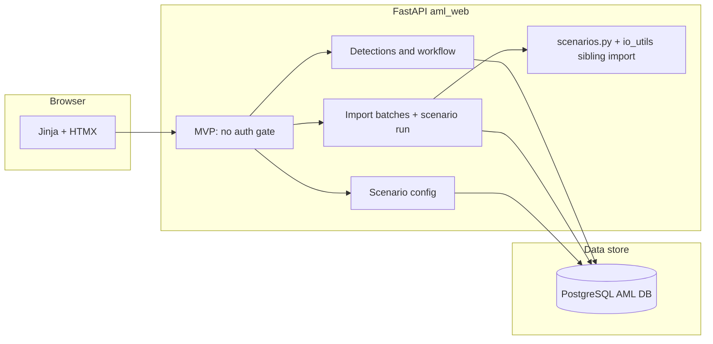

# AML web system — architecture outline (`aml_web/`)

## Goals (from your description)

- **Case-style workflow**: detections are triaged by **investigators**, who add **notes**, change **status**, and **assign to seniors** for review and **final decision** (full RBAC comes **after** the demo—see MVP scope below).
- **Persistence**: detections, underlying transactions (or references), notes, status history, and audit trail.
- **Configuration**: **scenario thresholds** editable in the UI; stored in PostgreSQL (`scenario_config`). Versioning / effective-dating remains a possible hardening step.
- **Import**: **manual Excel upload** first (same column contract as `io_utils.read_transactions_xlsx`); **automated ingestion** as a later phase.
- **Tech**: **FastAPI** backend; **on-prem** deployment. **Post-MVP**: built-in username/password and **roles in DB**.

## MVP scope (demo-first, manager review)

- **No authentication in MVP**: single “open” app so you can demo **UI fluidity**, **investigation workflow**, and **status transitions** without login friction. Clearly label as **demo / non-production** in the UI (banner + footer).
- **Still persist everything** in the database (detections, notes, statuses, imports, transaction rows, scenario config). **Free-text “Actor name”** on notes and status changes for demo audit without real auth.
- **Post-MVP (phase 1b)**: add **local accounts + RBAC** (investigator vs senior vs admin) and map the same UI actions to **server-enforced** permissions.

## Detection statuses (canonical)

All detections use exactly this **status enum** (store as stable string keys in DB, display labels in UI):

| Key                      | Label (UI)               | Meaning                                                                                       |
| ------------------------ | ------------------------ | --------------------------------------------------------------------------------------------- |
| `new`                    | New                      | New detection; not yet reviewed.                                                              |
| `false_positive_initial` | False positive (initial) | First investigator believes false positive; **awaits senior** for final decision.             |
| `suspicious_initial`     | Suspicious (initial)     | First investigator believes true positive / suspicious; **awaits senior** for final decision. |
| `false_positive_final`   | False positive (final)   | **Senior** final decision: false positive.                                                    |
| `suspicious_final`       | Suspicious (final)       | **Senior** final decision: suspicious.                                                        |
| `wallet_lock`            | Wallet lock              | Wallet **locked** (operational outcome).                                                      |
| `wallet_ci`              | Wallet CI                | Wallet switched to **Cashout-only** mode.                                                     |
| `pending_evidence`       | Pending evidence         | Customer **must provide evidence** before case can close or proceed.                          |

### Workflow intent (MVP)

- **Investigator path (demo)**: from **New**, can move to **False positive initial**, **Suspicious initial**, or **Pending evidence** as appropriate; can add notes at any time.
- **Senior path (demo)**: from **False positive initial** or **Suspicious initial**, can set **False positive final** or **Suspicious final**, and may also move to **Wallet lock**, **Wallet CI**, or **Pending evidence** where allowed by the graph below.
- **Operational outcomes**: **Wallet lock** and **Wallet CI** are **terminal** in the current MVP graph (no further transitions).

### Resolved transition matrix (MVP, enforced in API)

Implemented in `aml_web/app/constants.py` (`ALLOWED_TRANSITIONS`):

| From status | Allowed to |
|-------------|------------|
| `new` | `false_positive_initial`, `suspicious_initial`, `pending_evidence` |
| `false_positive_initial`, `suspicious_initial` | `false_positive_final`, `suspicious_final`, `pending_evidence`, `wallet_lock`, `wallet_ci` |
| `false_positive_final`, `suspicious_final` | `wallet_lock`, `wallet_ci`, `pending_evidence` |
| `pending_evidence` | `new`, `false_positive_initial`, `suspicious_initial` |
| `wallet_lock`, `wallet_ci` | *(none — terminal)* |

## Recommended high-level architecture

- **Web UI**: **Server-rendered Jinja2** + **HTMX** (e.g. note creation). Form posts and redirects elsewhere.
- **Database**: **PostgreSQL** for the AML app (`DATABASE_URL`), separate from analytics `minitrans_clone` / `actors_clean1_clone`. The web MVP does **not** call those sources for enrichment; the desktop `run.py` path may still use them.
- **Uploaded files**: Excel is parsed on upload; **normalized rows** are stored in **`transaction_rows.payload` (JSONB)**. Original binaries are not retained on disk in MVP.

## Core domain model (as implemented)

- **User** (post-MVP): username, hashed password, role(s). **MVP**: `author_name` on **Note**, `actor_name` on **StatusHistory**.
- **Role** (post-MVP): `investigator`, `senior`, `admin`.
- **ImportBatch** (`import_batches`): original filename, status (`uploaded` / `ready` / `failed`), row count, error message, timestamps.
- **TransactionRow** (`transaction_rows`): `import_batch_id`, `row_index`, `payload` JSONB (post–`add_helper_columns` row, includes `_aml_row_index` only in memory during scenario run; persisted rows use `row_index` column).
- **Detection** (`detections`): batch id, `scenario_id`, `period` (`daily` / `weekly`), `status`, `assigned_senior`, `metrics` JSONB (scenario output row), `raw_row_indices` JSONB (links to transaction `row_index` values).
- **Note** (`notes`): detection id, body, author name, created_at.
- **StatusHistory** (`status_history`): detection id, from/to status, actor name, created_at (written on each successful status change).
- **ScenarioConfig** (`scenario_config`): single active-style row with all numeric thresholds (defaults aligned with `ScenarioParams` / former `scenarios.json` fields). **Web path does not read or write `scenarios.json`.**

## Workflow rules

- **Post-MVP**: enforce **server-side** role checks (investigator vs senior) on transitions.
- **MVP**: transitions **validated** in the service layer against `ALLOWED_TRANSITIONS`; no auth.

## Security and compliance

- **MVP demo**: not suitable for production or real customer data without auth, HTTPS, and access control. Treat as **internal demo only**.
- **Post-MVP**: password hashing, RBAC, audit log, HTTPS, backups.

## Phased delivery

1. **MVP (implemented in `aml_web/`)**: **No auth**; detection list/detail; **status workflow** with enum and graph above; notes; **Excel upload** and **separate scenario run**; thresholds UI backed by Postgres; **Jinja + HTMX** UI; demo banner.
2. **Phase 1b**: **Auth + RBAC**; bind transitions to roles; optional `actor` from login.
3. **Hardening**: stronger audit export, search/filters, large-import performance; optional threshold versioning / effective dating; optional retention of uploaded files.
4. **Automation**: scheduled / automated ingestion.

## Relation to the existing Python script

- **`run.py`** / **`scenarios.py`** / **`io_utils.py`** remain the **reference** for rules and Excel shape. The web app **imports** `io_utils` and `scenarios` from the **repository root** (sys.path) when parsing uploads and running scenarios—no duplicated rule logic in `aml_web`.
- **Gap vs desktop**: web scenario run does **not** fetch wallet profiles or `last_30_days` from MariaDB (demo simplification). Those can be added later behind configuration.

## Open decisions (remaining / future)

- **Threshold audit**: optional history when thresholds change (today: last write wins; applies to **next** scenario run on an import).
- **Terminal states**: whether `wallet_lock` / `wallet_ci` should ever transition to another state for real operations (currently none in MVP).
- **Volume / UX**: large imports, attachments, Excel/PDF exports (optional follow-ups).

## Running the MVP locally

- **Env**: set **`DATABASE_URL`** for PostgreSQL (see `aml_web/app/config.py` default). With Docker Compose in `aml_web/`, Postgres is published on host port **15433** (not 5433) to reduce clashes with other local services.
- **Setup**: from `aml_web/`, `run_setup.cmd` or `.\run_setup.ps1` (installs deps, starts Compose with `--wait`, runs Alembic).
- **Migrations**: from `aml_web/`, `python -m alembic upgrade head`.
- **App**: from `aml_web/`, run **`start_app.cmd`** (binds **`127.0.0.1:8000`**) or `python -m uvicorn app.main:app --reload --host 127.0.0.1 --port 8000`. Open **`http://127.0.0.1:8000/`** (not https). **`/health`** returns `{"ok":true}` with no DB. If you use **Cursor over SSH/remote**, forward port **8000** in the Ports tab and use the forwarded URL.
